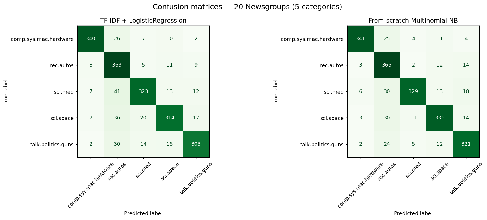

# Document Classifier

Sort documents into categories from their text alone — the workhorse NLP task,
built end to end: TF-IDF vectorisation, a linear model, and a from-scratch
Multinomial Naive Bayes written in numpy, evaluated head-to-head on a real
corpus.

- **Live site:** https://andreaisabelmontana.github.io/document-classifier/

## Dataset

[20 Newsgroups](https://scikit-learn.org/stable/datasets/real_world.html#newsgroups-dataset),
fetched via `sklearn.datasets.fetch_20newsgroups`. To keep training fast, a
focused 5-category slice spanning clearly different topics:

`comp.sys.mac.hardware` · `rec.autos` · `sci.med` · `sci.space` · `talk.politics.guns`

Headers, footers and quoted text are stripped (`remove=("headers","footers","quotes")`)
so the classifier learns from the prose, not from giveaway metadata like the
newsgroup name in the header. That makes the numbers honest — and a bit lower
than they'd be with the leakage left in. **2,905 train / 1,935 test** documents.

## Pipeline

```
raw text → TF-IDF (lowercase, English stopwords, 1–2 grams, min_df=2) → linear model → label
```

Two models are trained on the **same** TF-IDF features and compared:

1. **TF-IDF + LogisticRegression** — L2-regularised multinomial logistic
   regression (scikit-learn `Pipeline`). Fast, strong, weights stay readable.
2. **From-scratch Multinomial Naive Bayes** — `docclf/naive_bayes.py`, a genuine
   numpy implementation of the multinomial event model with Laplace (add-alpha)
   smoothing, done in log space for numerical stability. No sklearn estimator is
   used to fit or predict; a test asserts it matches `sklearn.MultinomialNB`'s
   log-priors, feature log-probs, predictions and posteriors to within `1e-8`.

## Results

Real numbers from `python train.py` on the held-out test split:

| Model | Accuracy | Macro-F1 |
|---|---|---|
| TF-IDF + LogisticRegression | **0.8491** | **0.8506** |
| From-scratch Multinomial NB | **0.8744** | **0.8758** |

Random baseline for 5 classes is 0.20. On this slice the simple Naive Bayes
edges out logistic regression — a good reminder that the classic, interpretable
approach is hard to beat on bag-of-words text.



The full per-class precision/recall/F1 report lives in
[`results.json`](results.json).

## Layout

```
docclf/
  naive_bayes.py   from-scratch Multinomial NB (numpy)
  pipeline.py      dataset loading + TF-IDF/LogReg pipeline
train.py           fit both models, evaluate, write results.json + confusion.png
predict.py         classify new text from --text / --file / stdin
tests/             pytest suite (NB vs sklearn, pipeline, results floor)
```

## Run it

```bash
pip install -r requirements.txt

python train.py          # fetches data, trains both models, writes artifacts
python -m pytest -q      # 12 tests

# classify new text
echo "NASA launched a rocket to study the moon and planets" | python predict.py
python predict.py --text "my car's engine kept stalling on the highway"
python predict.py --file some_document.txt
```

Example:

```
$ echo "NASA launched a rocket to study the moon and planets" | python predict.py
Predicted category: sci.space
Class probabilities:
  sci.space                99.67%  ##############################
  sci.med                   0.12%
  rec.autos                 0.10%
```

`train.py` saves the fitted pipeline to `model.joblib`; `predict.py` loads it.
The model file is git-ignored — regenerate it any time with `python train.py`.

## Tests

```
tests/test_naive_bayes.py   from-scratch NB matches sklearn within tolerance;
                            learns a toy corpus; probabilities sum to 1
tests/test_pipeline.py      TF-IDF pipeline trains + predicts an easy example
tests/test_results.py       results.json clears a sane accuracy floor (>0.60)
```

## License

MIT — see [LICENSE](LICENSE).
